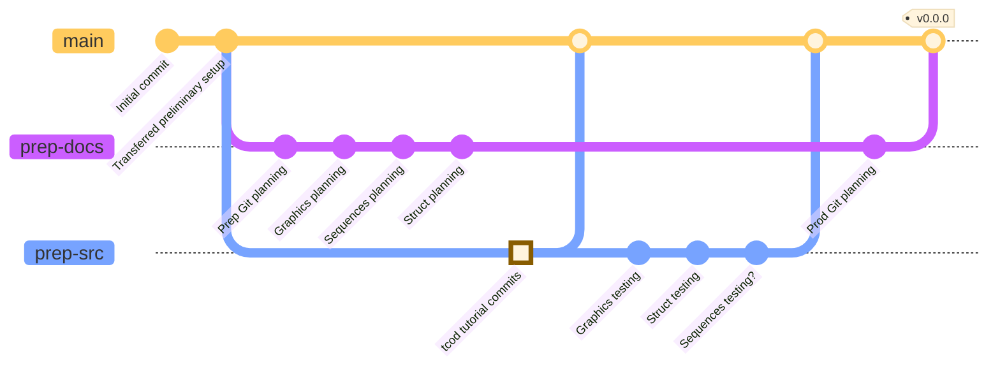

```mermaid
%%{init: { 'logLevel': 'debug', 'theme': 'base', 'gitGraph': {'rotateCommitLabel': true}} }%%
gitGraph

checkout main
commit id: "Initial commit"
commit id: "Transferred preliminary setup"

checkout main
branch prep-docs
commit id: "Prep Git planning"
commit id: "Graphics planning"
commit id: "Sequences planning"
commit id: "Struct planning"

checkout main
branch prep-src

checkout prep-src
commit id: "tcod tutorial commits" type: HIGHLIGHT
checkout main
merge prep-src
checkout prep-src
commit id: "Graphics testing"
commit id: "Struct testing"
commit id: "Sequences testing?"
checkout main
merge prep-src

checkout prep-docs
commit id: "Prod Git planning"

checkout main
merge prep-docs tag: "v0.0.0"

```