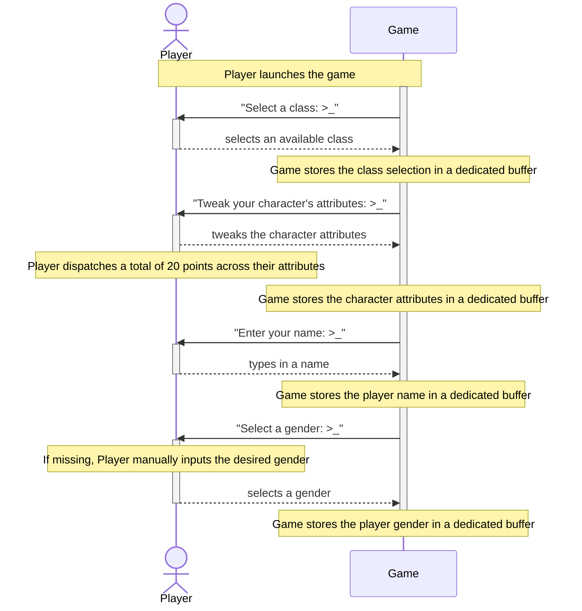

```mermaid
sequenceDiagram

    actor P as Player
    participant G as Game


    Note over P,G:Player launches the game
    activate G


    G->>P:"Select a class: >_"

    activate P
    P-->>G:selects an available class
    deactivate P
    Note over G:Game stores the class selection in a dedicated buffer


    G->>P:"Tweak your character's attributes: >_"

    activate P
    P-->>G:tweaks the character attributes
    Note over P:Player dispatches a total of 20 points across their attributes
    deactivate P
    Note over G:Game stores the character attributes in a dedicated buffer


    G->>P:"Enter your name: >_"

    activate P
    P-->>G:types in a name
    deactivate P

    Note over G:Game stores the player name in a dedicated buffer


    G->>P:"Select a gender: >_"

    activate P
    Note over P:If missing, Player manually inputs the desired gender
    P-->>G:selects a gender
    deactivate P
    Note over G:Game stores the player gender in a dedicated buffer

    deactivate G
```