# 

Git planning for the __preparatory phase__ of *Arithmancy*.

&nbsp;

Unless specified otherwise, all date intervals are to be understood as  [segments](https://en.wikipedia.org/wiki/Interval_(mathematics)#Note_on_conflicting_terminology).

&nbsp;

### Contents
- [Documentation](#documentation)
    - [Preparatory phase Git planning](#preparatory-phase-git-planning)
    - [Project planning](#project-planning)
    - [Graphics planning](#graphics-planning)
    - [Sequences/Gameplay planning](#sequencesgameplay-planning)
    - [Code structure planning](#code-structure-planning)
- [Source](#source)
    - [`tcod` tutorial commits](#tcod-tutorial-commits)
    - [Graphics testing](#graphics-testing)
    - [Code structure testing](#code-structure-testing)
    - [Game sequences testing](#game-sequences-testing)
- [Paving the way for the production phase](#paving-the-way-for-the-production-phase)
- [Postamble](#postamble)

---

## Documentation

At "worst", this section should last for __3 days__ in relative terms, and from the __15th of October 2022__ (`2022-10-15`) to the __17th of October 2022__ (`2022-10-17`) in absolute terms.

&nbsp;

### Preparatory phase Git planning

[A bit of recursivity, here](/__prep/docs/gitgraph/preparatoryPhaseGitPlanning.md), as this subsection covers how *Arithmancy*'s development will be carried out in Version Control using [Git](https://en.wikipedia.org/wiki/Git). This is both a single step in the preparatory phase and its entire structure's definition. This subsection aims at producing an entire Git graph of said phase, which can be found [at the bottom of this file](#postamble).

For now, let's visualize the theoretical development stage before any addition with this graph:

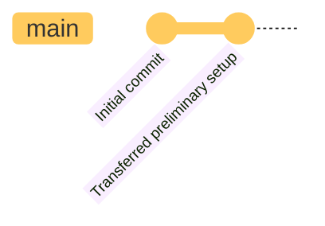

As of "now", there is one branch: the one and only `main`. This branch will - as it usually does - hold the "final" versions of the different stages of the game's development.

With the Git planning itself, the graph now theoretically looks like this: a new `prep-docs` branch for preparatory documentation has been added.

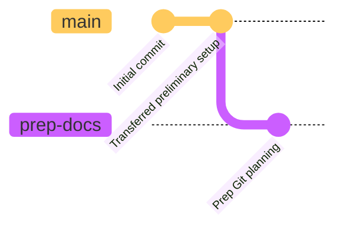

(In practice, the graph is complete.)

&nbsp;

### Project planning

Onwards, __project planning__.

This subsection defines the creation of the repository's structure, details about the project itself (such as a *README* file or licensing), and other more self-referential things (again with the recursivity, heh).

At this point, the Git graph should look like this:

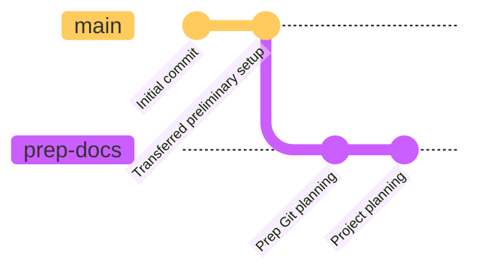

&nbsp;

### Graphics planning

After that come the game's graphics. This subsection focuses on the look of the game rather than its inner workings.

One of the main points is already "solved": __ASCII graphics__. These were chosen before the project even officially started. Getting a little out of the scope of this document, these will be implemented so that rather than manipulating actual characters and text strings, every character needed for the game will appear on a texture correspondingly mapped out and indexed by `tcod`, *Arithmancy*'s main library and depedency.

Other topics of interests for this subsection include the UI and other aesthetic choices for the game's visuals.

And with that out of the way, the Git graph elongates:

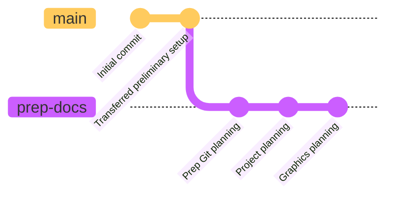

&nbsp;

### Sequences/Gameplay planning

This subsection will take care of planning out __game sequences__. Game sequences can be interpreted as queues of events, timelines of gameplay elements and episodes.

For example, the character creation, which sequence can be mapped out and planned, fits this subsection.

The Git graph then appears anew:

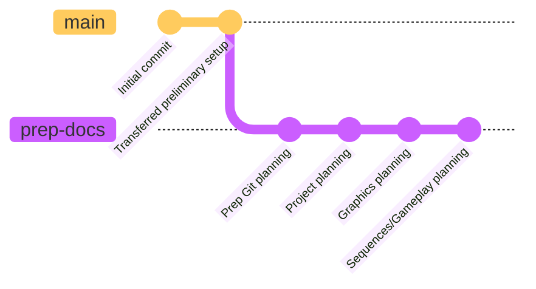

&nbsp;

### Code structure planning

Ending the first documentation segment, the __code structure__ needs planning.

The code structure is the type of documntation that comes the closest to manipulating actual source.

For example, the game's classes (as this game makes use of OOP) relationships can all be mapped out in a ULM class diagram (cf. [`classesStruct`](/__prep/docs/struct/classesStruct.md)).

Following this subsection's completion, the first documentation segment comes to a close. We commit the code structure planning and merge the `prep-docs` branch (although we do not delete it yet, as it will come useful later on):

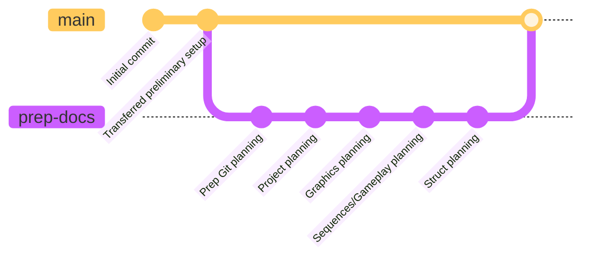

---

## Source

This section can be divided in two segments.

The first, `tcod` tutorial commits, should last for __7 days__ in relative terms. 
In absolute terms, it should last from the __18th of October 2022__ (`2022-10-18`) to the __24th of October 2022__ (`2022-10-24`).

The second, preparatory source testing, should last for __4~5 days__ in relative terms. 
In absolute terms, it should last from the __25th of October 2022__ (`2022-10-18`) to the __28th~29th of October 2022__ (`2022-10-24`).

&nbsp;

### `tcod` tutorial commits

This section should actually be comprised of about 14 commits, all made up of consecutive part of the [2020 version of the *Yet Another Roguelike Tutorial - Written in Python 3 and TCOD*](https://rogueliketutorials.com/tutorials/tcod/v2/).

This segment will serve as a way to get a feel of the main library, and possible implementations of several functionalities present in the final game (such as windows, logs, and menus...).

In practice, the graph should look like this:

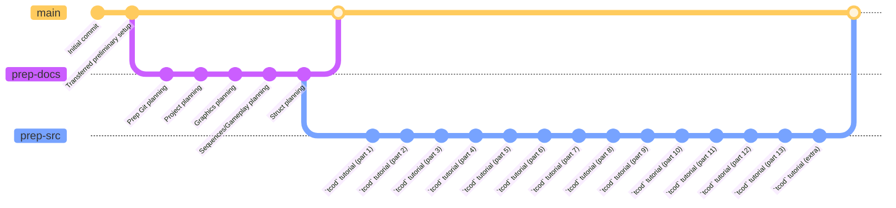

First, notice the new branch created to host additions to preparatory source code: `prep-src`. We then merge said branch in `main` without deleting it, as we'll keep working on it right after this subsection.

However, this all is a little bothersome to look at, especially considering we have more commits ahead of us, so let's condense it down a little:

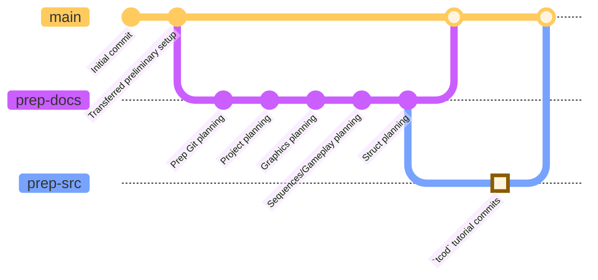

&nbsp;

### Graphics testing

This subsection serves as the first commit of the second segment of the preparatory phase's. It focuses on testing out needed features of the game's graphics, e.g. drawing separate windows, printing out "characters"...

The graph then keeps growing:

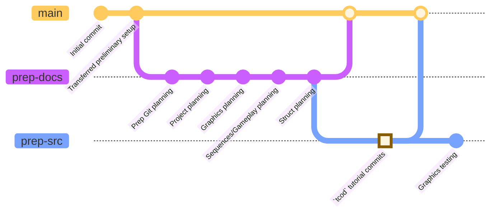

&nbsp;

### Code structure testing

Following up, the previously planned code structure needs to be tested out. For example, the OOP classes need to be tested out in order not to start creating the game, but rather see if their relationship (mainly __inheritance__) if funtional; using simple tools such as `print`ing out text via methods.

And with this subsection complete, the preparatory source commits' end draws near:

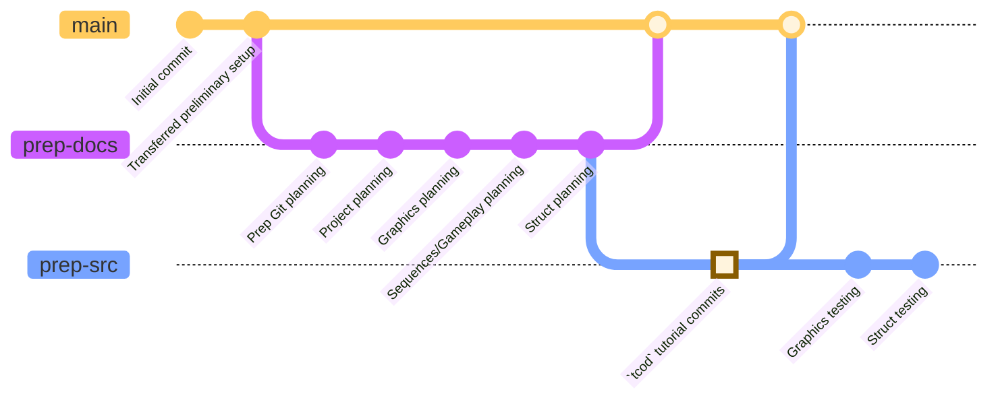

&nbsp;

### Game sequences testing

This step's completion is uncertain. Because of how close it comes to an actual production phase, this subsection might not even be started.

If actually completed, it will focus on testing planned game sequences, such as character creation, gameplay elements or even player death.

And here comes the closure of the preparatory source testing phase, and the merging of the `prep-src` branch into `main`:

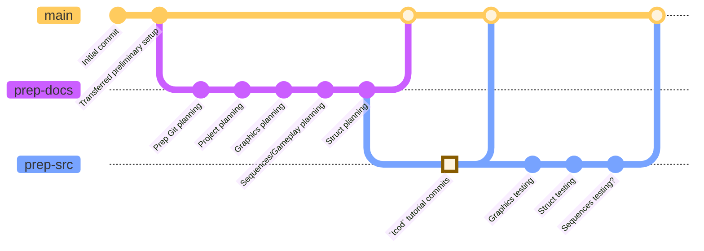

---

## Paving the way for the production phase

At this point, everything is planned out and if required, is tested. This now calls for a crucial step: __production phase planning__.

This constitutes the second preparatory documentation segment and theoretically represents the final commit of the preparatory phase before merging the `prep-docs` branch into `main` one last time, allowing for the release of version `v0.0.0`.

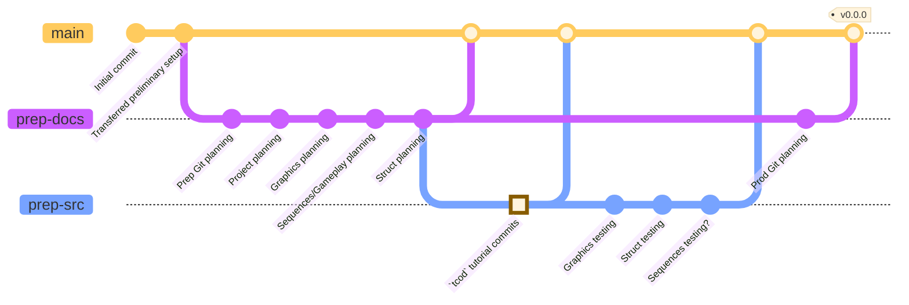

---

## Postamble

The preparatory phase for *Arithmancy* should last for __17 days__ of the game's __≈47 days (1 month and 17 days)__ of allowed development (basically ranging from the __15th of October 2022__ (`2022-10-15`) to the __31st of October 2022__ (`2022-10-31`) ) until the project's deadline (near the end of November).

From this will arise version `v0.0.0`, after which the game will hopefully enter its __production phase__ - i.e. proper game development - without any hiccups.

