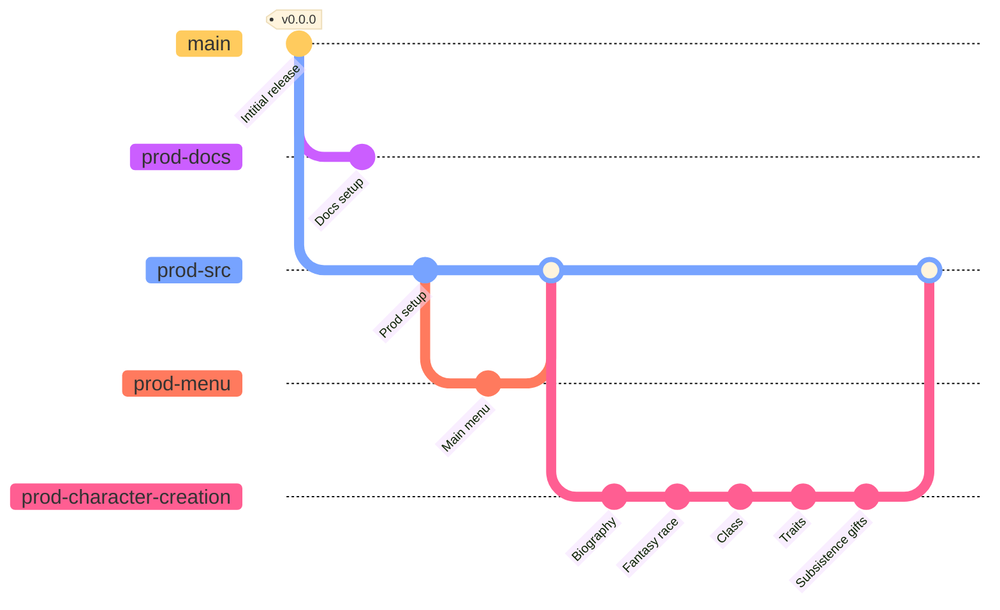

# 

Git planning for the __production phase__ of *Arithmancy*.

&nbsp;

Unless specified otherwise, all date intervals are to be understood as  [segments](https://en.wikipedia.org/wiki/Interval_(mathematics)#Note_on_conflicting_terminology).

&nbsp;

### Contents
- [Paving the way for the post-mortem phase](#paving-the-way-for-the-post-mortem-phase)
- [Postamble](#postamble)

---

## Postamble

The production phase for *Arithmancy* should last for __30 days__ of the game's __≈47 days (1 month and 17 days)__ of allowed development (basically ranging from the __1st of November 2022__ (`2022-10-15`) to the __30th of November 2022__ (`2022-10-31`) ) until the project's deadline (near the end of November).

From this will arise version `v1.0.0`, after which the game will quite possibly enter its __post-mortem phase__ - i.e. additional development independant of the original project - without any hiccups.

