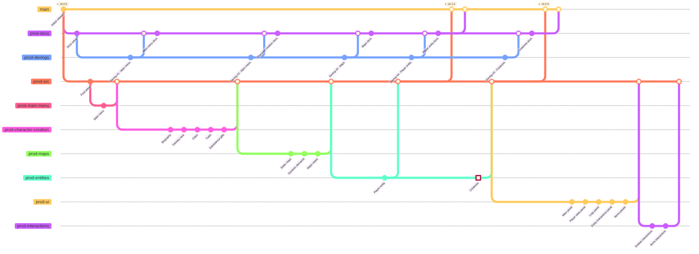

# 

Git planning for the __production phase__ of *Arithmancy*.

&nbsp;

Unless specified otherwise, all date intervals are to be understood as  [segments](https://en.wikipedia.org/wiki/Interval_(mathematics)#Note_on_conflicting_terminology).

An issue in *mermaid-js*' GitGraph rendering makes the completion of the production phase Git graph impossible at the time of writing. As such, it is currently incomplete as well as being buggy is left "as is".

&nbsp;

### Contents
- [Documentation branch](#documentation-branch)
    - [Devlogs](#devlogs)
- [Source branch](#source-branch)
- [Main menu](#main-menu)
- [Character creation](#character-creation)
- [Maps](#maps)
- [Entities](#entities)

---

## Documentation branch

&nbsp;

### Devlogs

---

## Source branch

---

## Main menu

---

## Character creation

---

## Maps

---

## Entities

---

## Postamble

The production phase for *Arithmancy* should last for __30 days__ of the game's __≈47 days (1 month and 17 days)__ of allowed development (basically ranging from the __1st of November 2022__ (`2022-11-01`) to the __30th of November 2022__ (`2022-11-30`) ) reaching the project's deadline.

From this will arise version `v1.0.0`, after which the game will quite possibly enter its __post-mortem phase__ - i.e. additional development independant of the original project - without any hiccups.

<!--
checkout prod-src
branch prod-combat
commit id:"Combat" type:HIGHLIGHT
checkout prod-src
merge prod-combat-->