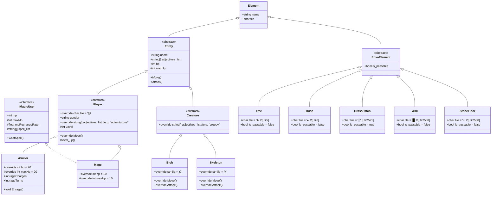

<!--! REMEMBER TO SET THE GRAPH DIRECTION TO "TB" -->



<!-- ```mermaid
classDiagram
direction LR
    Entity <|-- Player
    Entity <|-- Creature

    Player <|-- Warrior
    Player <|-- Mage

    Creature <|-- Blob
    Blob <|-- ShartBlob

    Creature <|-- Skeleton
    Skeleton <|-- SpookySkeleton
    Skeleton <|-- SpoopySkeleton


    IMagicUser <|.. Mage
    IFecalFunny <|.. SpoopySkeleton
    IFecalFunny <|.. ShartBlob


    class IMagicUser {
        <<interface>>
        +int mp
        #int maxMp
        
        
        +CastSpell()
    }

    class IFecalFunny {
        <<interface>>
        +string Smell

        +Flatulate()
        +Defecate()
    }


    class Entity {
        <<abstract>>
        +string Name

        +int hp
        #int maxHp

        +Move()*
        +Attack()*
    }


    class Player {
        <<abstract>>
        +string Gender

        #int Level


        +Move()
        #LevelUp()*
    }

    class Warrior {
        #int RageCharges


        +override Attack()
        +Enrage()

        #LevelUp()
    }

    class Mage {
        +override Attack()

        #LevelUp()
    }


    class Creature {
        <<abstract>>
    }

    class Blob {
        +list RgbColor
        +override Attack()
    }

    class ShartBlob {
        +list RgbColor = (128, 64, 0)
        +override Attack()
    }

    class Skeleton {
        +override Attack()
    }

    class SpookySkeleton {
        +Agonize() void
    }

    class SpoopySkeleton {
    }
``` -->