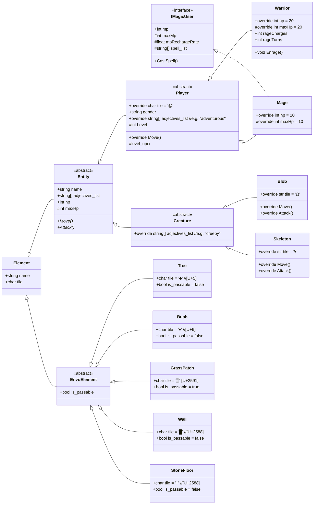

<!--!=============================================!-->
<!--! REMEMBER TO SET THE GRAPH DIRECTION TO "TB" !-->
<!--!=============================================!-->

```mermaid
classDiagram
direction LR
    IMagicUser <|.. Mage

    Element <|-- Entity
    Element <|-- EnvoElement

    Entity <|-- Player
    Entity <|-- Creature

    Player <|-- Warrior
    Player <|-- Mage

    Creature <|-- Blob
    Creature <|-- Skeleton

    EnvoElement <|-- Tree
    EnvoElement <|-- Bush
    EnvoElement <|-- GrassPatch
    EnvoElement <|-- Wall
    EnvoElement <|-- StoneFloor


    class IMagicUser {
        <<interface>>
        +int mp
        #int maxMp
        #float mpRechargeRate

        #string[] spell_list

        +CastSpell()
    }


    class Element {
        +string name
        +char tile
    }


    class Entity {
        <<abstract>>
        +string name
        +string[] adjectives_list

        +int hp
        #int maxHp

        +Move()*
        +Attack()*
    }


    class Player {
        <<abstract>>
        +override char tile = '@'
        +string gender
        +override string[] adjectives_list //e.g. "adventurous"

        #int Level


        +override Move()
        #level_up()
    }

    class Warrior {
        +override int hp = 20
        #override int maxHp = 20

        +int rageCharges
        +int rageTurns


        +void Enrage()
    }

    class Mage {
        +override int hp = 10
        #override int maxHp = 10
    }


    class Creature {
        <<abstract>>
        +override string[] adjectives_list //e.g. "creepy"
    }

    class Blob {
        +override str tile = 'Ω'
        +override Move()
        +override Attack()
    }

    class Skeleton {
        +override str tile = '¥'
        +override Move()
        +override Attack()
    }


    class EnvoElement {
        <<abstract>>
        +bool is_passable
    }

    class Tree {
        +char tile = '♣' //[U+5]
        +bool is_passable = false
    }

    class Bush {
        +char tile = '♠' //[U+6]
        +bool is_passable = false
    }

    class GrassPatch {
        +char tile = '░' [U+2591]
        +bool is_passable = true
    }


    class Wall {
        +char tile = '█' //[U+2588]
        +bool is_passable = false
    }

    class StoneFloor {
        +char tile = '+' //[U+2588]
        +bool is_passable = false
    }
```