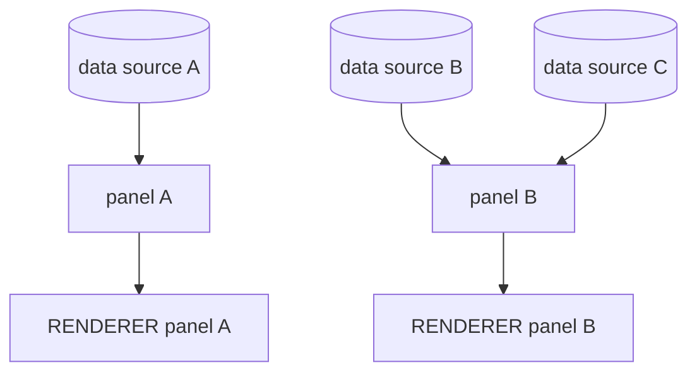

<!--!=============================================!-->
<!--! REMEMBER TO SET THE GRAPH DIRECTION TO "TB" !-->
<!--!=============================================!-->

# 

__Code structure__ planning for the UI of *Arithmancy*.

### Contents
- [Overview](#overview)
- [Map-roaming](#map-roaming)
    - [Player attributes](#player-attributes)

---

## Overview

The overall structure of the game's UI components will consist of several panels, each containing specific data. These panels are all linked to one renderer which will draw the panels on top of the main state (e.g. the world map) every turn.



*A non exhaustive representation of the overall UI structure: panels get data from several sources and are printed out by the corresponding renderer.*

---

## Map-roaming

This section's weird name encompasses everything that relates to moving the player character about in an environment.

In this section, several panel will get data from the game elements as well as game sequences such as dialogues.

&nbsp;

### Player attributes

To start it off, the player attributes panel.

#### Data sources

|Type|Name|Remarks|
|:-|:-|:-:|
|string|name||
|EntityRace|race||

---

<!--```mermaid
erDiagram
    STATS-PANEL ||--|{ PLAYER : "gets player stats"
    ADVENTURE-RENDERER ||--|{ STATS-PANEL : "prints panel & its content"
    ADVENTURE-RENDERER ||--|{ LOGS-PANEL : "prints panel & its content"


    PLAYER {
        string name
        CharacterRace race
        AdventurerClass class
        string title
        int hp
        int mp
        list-string status_effects
    }

    STATS-PANEL {
        int x
        int y
        int width
        int height
        string title
    }

    LOGS-PANEL {
        int x
        int y
        int width
        int height
        string title
    }
```-->